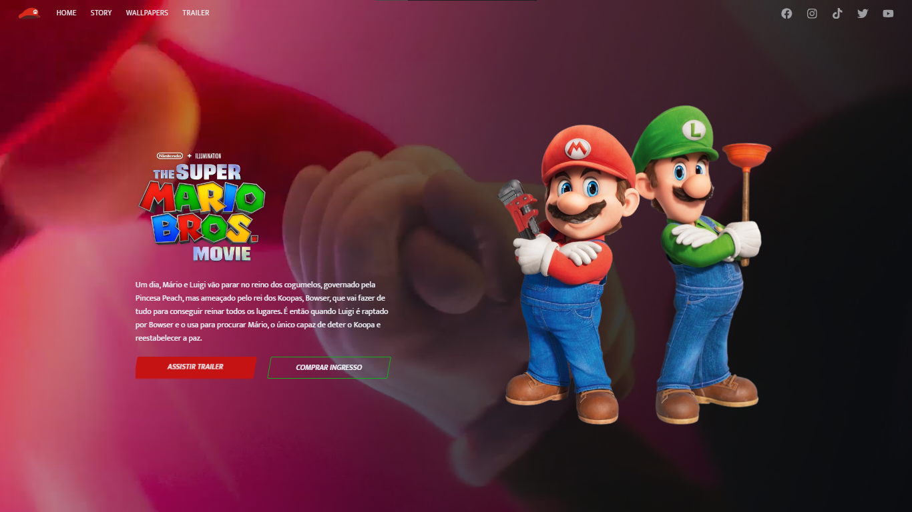
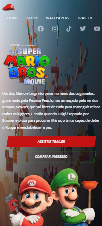

###Criando uma Landing Page do Filme Mario Bross

<h3>Para telas maiores:</h3>

<h3>Para telas menores:</h3>

###

<h3>Baseado no tutorial do Leo Vargas, no YouTube.
Fiz apenas algumas alterações para deixar responsivo. Espero que gostem!</h3>
<a href="https://www.youtube.com/watch?v=6Ok-kUrBGp8&t=763s" target="_blank">Acessar</a>